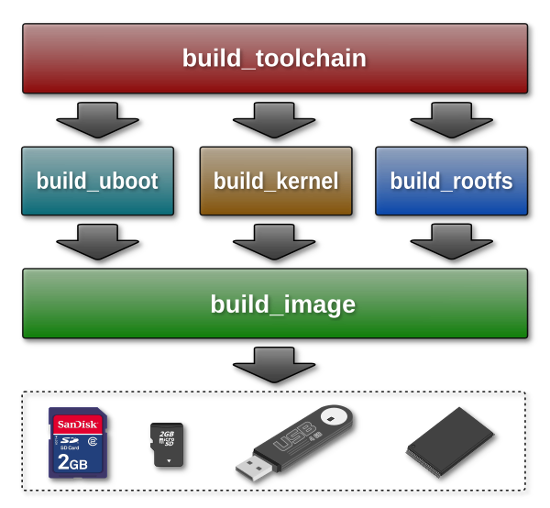

# Enablement for Embedded Linux Development

This repository contains a set of automatization scripts for:

* generating virtual machine with Linux OS (debian or ubuntu)
* compiling `toolchain`, `u-boot` and `kernel`
* building `rootfs` for different Linux distributions like `debian`, `ubuntu`, ...
* creating or extracting bootable `SD Card` image

## Motivation

Building a bootable SD-Card image with Debian based embedded Linux OS for [i.MX](http://www.nxp.com/products/microcontrollers-and-processors/arm-processors/i.mx-applications-processors:IMX_HOME) platform is too complex task. This project is trying to decrease its complexity and make the process much easier and user friendly.


## Installation

In Debian based Linux distributions just install the package [emlinux-tools_x.x.x_all.deb](https://github.com/molejar/emLinux/releases) from release section.

```bash
   $ wget --quiet https://github.com/molejar/emLinux/releases/download/x.x.x/emlinux-tools_x.x.x_all.deb
   $ sudo dpkg -i emlinux-tools_x.x.x_all.deb
```
>Replace `x.x.x` with the version number of last release !

In Windows OS you will need to use the Virtual Machine. I have created a Vagrant script which will do all the work for you. Just download the [emlinux-vm_x.x.x.zip](https://github.com/molejar/emLinux/releases) and extract it into your disk. Then continue reading here: [Virtual Machine Builder](https://github.com/molejar/emLinux/wiki/VM)

## Usage

The following picture describes general usage of this automatization scripts. As you can see from picture, every script covers a specific role in image build process and is accessible as standard shell command.

<p align="center">
  
</p>

***All Implemented commands:***

* **build_toolchain** - *Prepare toolchain for bootloader and kernel building*
* **build_barebox** - *Build [BareBox](http://www.barebox.org/) Bootloader (replacement of U-Boot)*
* **build_uboot** - *Build [U-Boot](https://www.denx.de/wiki/U-Boot/WebHome) Bootloader from sources in git repo*
* **build_kernel** - *Build [Linux Kernel](https://www.kernel.org/) from sources in git repo*
* **build_rootfs** - *Build minimal RootFS based on Debian packages*
* **build_image** - *Create SD Card image from uboot, kernel and rootfs*

With argument `-h` or `-?` you can print the command usage. Read [Wiki](https://github.com/molejar/emLinux/wiki) page for 
more details.

For embedded Linux development under Windows OS read [Step-By_step](doc/step_by_step.md) tutorial.

## GPU and VPU support
Description for GPU and VPU is [here](gpu_vpu/README.md)

## Development

Clone this repository into your local disk (running Linux OS).

```bash
   $ git clone https://github.com/molejar/emLinux.git
   $ cd emLinux
```

In Debian based Linux distributions install all dependencies and execute `install.sh` script.

```bash
   $ sudo apt-get install build-essential, u-boot-tools, device-tree-compiler, qemu-user-static
   $ sudo apt-get install binfmt-support, debootstrap, binutils, parted, realpath, git, lzop, gzip, zip

   $ sudo ./install.sh
```

In other Linux distributions use [Virtual Machine Builder](https://github.com/molejar/emLinux/wiki/VM).

```bash
   $ vagrant up
   $ ...
```

## TODO

## Usefull Links

* [Debian Quality Assurance](https://piuparts.debian.org)
* [armbian](https://www.armbian.com/)


